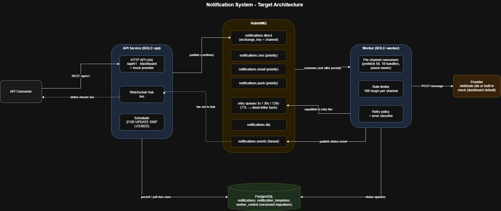
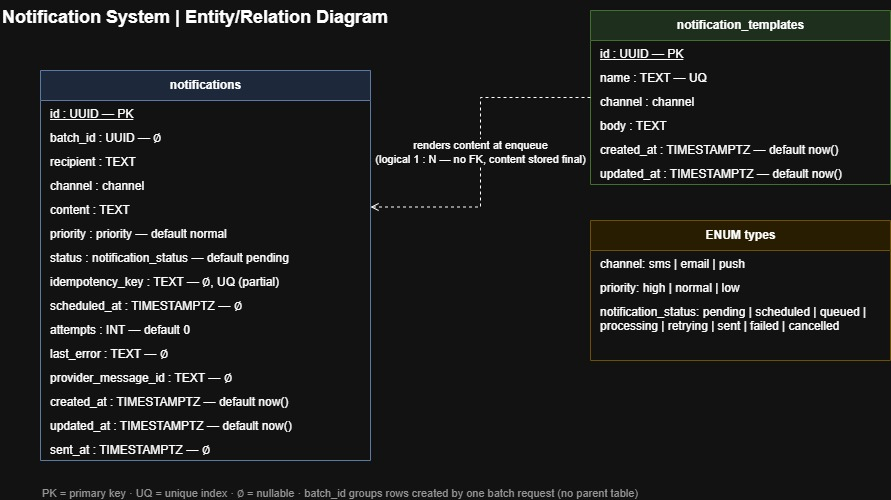

# Notifier

An event-driven notification system in Go. Notifications come in over a
REST API, wait in RabbitMQ, and are delivered asynchronously to SMS,
Email, and Push channels with per-channel rate limiting, tiered retries,
and real-time status tracking.

Built for the Insider One Software Engineer Assessment.

## Quickstart

```bash
docker compose up --build
```

One command starts PostgreSQL, RabbitMQ, the API, and the worker.
Migrations apply automatically at boot. Then open:

- **Testing dashboard**: http://localhost:8081/dashboard
- **API docs (Swagger UI)**: http://localhost:8081/docs
- **RabbitMQ management**: http://localhost:15672 (notifier/notifier)

By default the worker delivers to a built-in mock provider, so everything
works offline. To deliver to webhook.site instead, either set
`PROVIDER_URL=https://webhook.site/<uuid>` before `docker compose up`, or
paste the URL into the dashboard's Provider panel at runtime.

### The dashboard

The dashboard is the fastest way to evaluate the system: send single,
scheduled, templated, or batch notifications; run one-click scenarios
(idempotency, retry, dead letter, cancel, priority, rate limit,
scheduling, templates, batch); pause and resume the worker; watch queues
drain, WebSocket events stream, and messages land on simulated devices.
Every action is traced in the wire log with real request and response
summaries.

## Architecture



- `cmd/notifier`: single binary; `ROLE=api|worker|all` selects components.
- `internal/domain`: pure types, the status state machine, validation.
- `internal/service`: create, batch, cancel, list, template rendering,
  idempotent replay.
- `internal/storage/postgres`: pgx repositories and embedded migrations.
- `internal/queue/rabbit`: topology, confirmed publishing, consuming.
- `internal/worker`: claims deliveries, rate limits, applies retry policy.
- `internal/scheduler`: fires scheduled notifications, recovers lost work.
- `internal/delivery`: provider senders (webhook, mock, runtime-switchable).
- `internal/api`: chi handlers, WebSocket hub, testing dashboard.

Status lifecycle:

```
pending ──► queued ──► processing ──► sent
scheduled ─┘   ▲            │
               └─ retrying ◄┘──► failed
pending | scheduled | queued ──► cancelled
```

Every transition is enforced twice: in the domain state machine and in
SQL with guarded conditional updates. Concurrent workers can never
double-deliver or resurrect a cancelled notification.

### Data model



Versioned migrations carry business schema only (`notifications`,
`notification_templates`). The single-row `worker_control` table holds
operational state (the dashboard's pause flag and provider override) and
is declared idempotently at boot, like the queue topology. If your dev
volume predates this split, reset it once with `docker compose down -v`.

## API examples

Create:

```bash
curl -X POST localhost:8081/api/v1/notifications \
  -H 'Content-Type: application/json' \
  -d '{"recipient":"+905551234567","channel":"sms","content":"Hello!","priority":"high"}'
```

Idempotent create (same key returns the original with 200):

```bash
curl -X POST localhost:8081/api/v1/notifications \
  -H 'Content-Type: application/json' \
  -d '{"recipient":"+905551234567","channel":"sms","content":"Hi","idempotency_key":"order-42"}'
```

Schedule for later:

```bash
curl -X POST localhost:8081/api/v1/notifications \
  -H 'Content-Type: application/json' \
  -d '{"recipient":"+905551234567","channel":"sms","content":"Reminder!","scheduled_at":"2026-07-05T09:00:00Z"}'
```

Templates render at enqueue time; missing variables are rejected:

```bash
curl -X POST localhost:8081/api/v1/templates \
  -H 'Content-Type: application/json' \
  -d '{"name":"otp","channel":"sms","body":"Your code is {{.code}}."}'

curl -X POST localhost:8081/api/v1/notifications \
  -H 'Content-Type: application/json' \
  -d '{"recipient":"+905551234567","channel":"sms","template":{"name":"otp","vars":{"code":"421337"}}}'
```

Batch (up to 1000 per request, per-item results):

```bash
curl -X POST localhost:8081/api/v1/notifications/batch \
  -H 'Content-Type: application/json' \
  -d '{"notifications":[{"recipient":"+905551111111","channel":"sms","content":"one"},
                        {"recipient":"+905552222222","channel":"sms","content":"two"}]}'
```

Query, list, cancel:

```bash
curl localhost:8081/api/v1/notifications/<id>
curl 'localhost:8081/api/v1/notifications?status=sent&channel=sms&limit=20'
curl -X POST localhost:8081/api/v1/notifications/<id>/cancel
```

Live status stream: connect a WebSocket to `ws://localhost:8081/ws`
(add `?id=<uuid>` to follow one notification).

Observability: `GET /metrics` (Prometheus), `GET /healthz` (liveness),
`GET /readyz` (per-dependency readiness).

The full contract lives in `api/openapi.yaml`, served at
`/api/v1/openapi.yaml` and rendered at `/docs`.

## Delivery and retry design

- **Effectively-once delivery.** Queue messages carry only the
  notification ID. Workers claim rows atomically with
  `UPDATE ... WHERE status IN (...) RETURNING`, so redelivered or
  duplicate messages find the row already claimed, sent, or cancelled
  and are dropped. Acks happen only after the outcome is persisted.
- **Error classification.** Network errors, timeouts, HTTP 5xx and 429
  are retryable; other 4xx are permanent; unknown errors default to
  retryable, which is safe under the claim guard.
- **Tiered backoff without plugins.** Retryable failures republish to
  fixed-TTL queues (5s, 30s, 120s) whose dead-letter exchange routes back
  to the original work queue. Attempts cap at 4; exhausted or permanent
  failures persist `failed` with `last_error` and go to the DLQ.
- **Rate limiting.** A shared token bucket per channel caps deliveries at
  100/s across that channel's concurrent handlers.
- **Priority.** Queues use `x-max-priority`; high/normal/low map to AMQP
  priorities 9/5/1, so high-priority messages jump any backlog.
- **Scheduling and self-healing.** A 1s poller claims due rows with
  `FOR UPDATE SKIP LOCKED`. The same sweep rescues lost publishes and
  rows stranded in `processing` by a crashed worker.
- **Correlation IDs** flow from `X-Request-ID` through AMQP headers into
  worker logs, so one grep follows a notification end to end.

## Known limitations

Deliberate scope decisions, in code comments and here rather than hidden:

- Rate limits are per process. N worker replicas mean N x 100/s; set
  `RATE_LIMIT_PER_CHANNEL=100/N` when scaling out.
- No AMQP auto-reconnect. If RabbitMQ restarts, consumers exit and the
  orchestrator restarts the process (`restart: unless-stopped` in compose).
- Prometheus counters reset on restart (standard behavior). The dashboard
  shows session metrics next to lifetime totals from the database.
- Distributed tracing was skipped; correlation IDs cover the story at
  this scale.

## Configuration

Everything is environment-driven (defaults in parentheses):

| Variable | Purpose |
|---|---|
| `ROLE` | `api`, `worker`, or `all` (all) |
| `HTTP_PORT` | API and ops port (8081) |
| `DATABASE_URL` | Postgres DSN |
| `RABBITMQ_URL` | AMQP URL |
| `PROVIDER_URL` | Delivery endpoint; empty = log-simulated sends |
| `PROVIDER_TIMEOUT` | Outbound send timeout (10s) |
| `MAX_DELIVERY_ATTEMPTS` | First try + retries (4) |
| `MAX_BATCH_SIZE` | Items per batch request (1000) |
| `RATE_LIMIT_PER_CHANNEL` | Deliveries/sec per channel (100) |
| `WORKER_CONCURRENCY` | Handlers per channel queue (10) |
| `WORKER_PREFETCH` | AMQP prefetch per consumer (50) |
| `SCHEDULER_POLL_INTERVAL` | Due-row poll cadence (1s) |
| `STALE_PENDING_AFTER` | Lost-publish sweep cutoff (1m) |
| `DASHBOARD_ENABLED` | Mount dashboard + mock provider (compose: true) |
| `WORKER_METRICS_URL` | Merge worker metrics into dashboard summary |
| `SHUTDOWN_TIMEOUT` | Graceful drain budget (15s) |
| `LOG_LEVEL` | debug/info/warn/error (info) |

## Testing

```bash
make test            # unit tests with -race (CI runs the same)
go test -race ./...  # the same, without make
./scripts/test.sh    # full matrix: vet, unit, coverage, race, live e2e checks
scripts\test.bat     # Windows twin of the full matrix
```

The `-race` flag needs a C toolchain (gcc). On machines without one
(common on Windows), run `go test ./...`; CI always runs the race
detector.

Tests are table-driven with hand-written fakes. They cover the state
machine, validation, retry policy, rate limiting, idempotent replay,
batch partial success, cursor pagination, the WebSocket hub, and handler
status codes. Integration tests exercise the guarded SQL against a real
PostgreSQL (`TEST_DATABASE_URL`) and the queue topology, retry TTL
routing, DLQ, and events fanout against a real RabbitMQ
(`TEST_AMQP_URL`). CI runs both in service containers; locally the test
scripts provision an isolated `notifier_test` database and vhost on the
compose stack automatically. The dashboard's scenario runner doubles as
an interactive acceptance suite.

CI (GitHub Actions) runs build, vet, golangci-lint, and `go test -race`
on every push.

## Development

The Makefile is a thin index of entry points; every target has a direct
equivalent, so `make` itself is optional:

```bash
make up      # docker compose up -d postgres rabbitmq
make run     # go run ./cmd/notifier
make lint    # gofmt -l . && go vet ./... && golangci-lint run
make deploy  # ./scripts/deploy.sh local   (Windows: scripts\deploy.bat local)
```

Deploy and test scripts have Windows twins (`scripts/*.bat`) and work
from any directory. The dashboard, OpenAPI spec, and migrations are
embedded in the binary, so the compose image is self-contained. Editable
diagram sources are in `docs/*.drawio` (open with diagrams.net).
